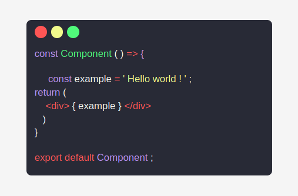

## Code window

Exemplo base para você adicionar em seus layouts que precisam simular um exemplo de código:

 
 

### Dicas

- espaço simples: &nbsp

- tab: &nbsp&nbsp&nbsp&nbsp  

- ' < ' : &lt

- ' > ' : &gt